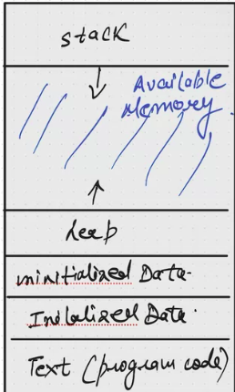

# Memory layout of a process

A program that is currently running in a system is termed as process. A process can have its own child processes. How the heirachy is maintained is, the first process to be booted is systemd who doesnot have any parent process.
Each child process has an id 0 and any non zero id belongs to the parent.

- `getpid` - used to get the id for the process
- `getppid` - used to get the id for the parent process.
- `fork` - used to create a child process

### How Each program gets translated into Memory ?

In general your process allocates data structures like Stack and Heap.



Now when you are creating a process you dont have to worry about disturbing the memory of other processes. So we introduced a concept called virtual memory.
A process usually believes that you have the entire resource for yourself. Its the OS responsibility to make sure the resources are shared evenly.

for a 64 bit OS, the number of addresses available to a process are 2^64.
suppose you are given this code

> Unitialized data segment can also be refered as bss

```c
#include<stdio.h>
...

char buf[256]; // uninitialized data segment
int[] x  = {2,3,4,5} // initialized data segment

static int foo(){
    // command
    return 0;
}

int main(int argc, char* argv[]){
    int c = 50;
    static int[] i;
    static int[] j = {1,2,3,4};
    char *p = malloc(size(char)*100);

    // other operation
    foo();
}
```
